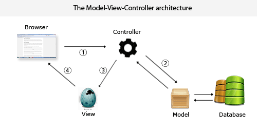

[comment]: <> ([![Build Status]&#40;https://travis-ci.org/m4rciosouza/ponto-inteligente-api.svg?branch=master&#41;]&#40;https://travis-ci.org/m4rciosouza/ponto-inteligente-api&#41;)

# Stack Cloud Architecture


Schedule System API with Java and Spring Boot.
***

## Schedule

***

### File structure

```
spring-boot-jwt/
 │
 ├── src/main/java/
 │   └── renato
 │       ├── configuration
 │       │   └── SwaggerConfig.java
 │       │
 │       ├── controller
 │       │   └── UserController.java
 │       │
 │       ├── dto
 │       │   ├── UserDataDTO.java
 │       │   └── UserResponseDTO.java
 │       │
 │       ├── exception
 │       │   ├── CustomException.java
 │       │   └── GlobalExceptionController.java
 │       │
 │       ├── model
 │       │   ├── Role.java
 │       │   └── User.java
 │       │
 │       ├── repository
 │       │   └── UserRepository.java
 │       │
 │       ├── security
 │       │   ├── JwtTokenFilter.java
 │       │   ├── JwtTokenFilterConfigurer.java
 │       │   ├── JwtTokenProvider.java
 │       │   ├── MyUserDetails.java
 │       │   └── WebSecurityConfig.java
 │       │
 │       ├── service
 │       │   └── UserService.java
 │       │
 │       └── JwtAuthServiceApp.java
 │
 ├── src/main/resources/
 │   └── application.yml
 │
 ├── .gitignore
 ├── LICENSE
 ├── mvnw/mvnw.cmd
 ├── README.md
 └── pom.xml
```

```json
{
  "alg": "HS256",
  "typ": "JWT"
}
```

```json
{
  "sub": "1234567890",
  "name": "John Doe",
  "admin": true
}
```

The payload is then Base64Url encoded to form the second part of the JSON Web Token.

**Signature**

To create the signature part you have to take the encoded header, the encoded payload, a secret, the algorithm specified in the header, and sign that.

For example if you want to use the HMAC SHA256 algorithm, the signature will be created in the following way:

```
HMACSHA256(
  base64UrlEncode(header) + "." +
  base64UrlEncode(payload),
  secret)
```


## H2 DB

This demo is currently using an H2 database called **test_db** so you can run it quickly and out-of-the-box without much configuration. If you want to connect to a different database you have to specify the connection in the `application.yml` file inside the resource directory. Note that `hibernate.hbm2ddl.auto=create-drop` will drop and create a clean database each time we deploy (you may want to change it if you are using this in a real project). Here's the example from the project, see how easily you can swap comments on the `url` and `dialect` properties to use your own MySQL database:

```yml
spring:
  datasource:
    url: jdbc:h2:mem:test_db;DB_CLOSE_DELAY=-1;DB_CLOSE_ON_EXIT=FALSE
    # url: jdbc:mysql://localhost:3306/spring_boot_docker?autoReconnect=true&useSSL=false
    username: root
    password: root
  tomcat:
    max-wait: 20000
    max-active: 50
    max-idle: 20
    min-idle: 15
  jpa:
    hibernate:
      ddl-auto: create-drop
    properties:
      hibernate:
        dialect: org.hibernate.dialect.H2Dialect
        # dialect: org.hibernate.dialect.MySQL8Dialect
        format_sql: true
        id:
          new_generator_mappings: false
```


```java
String token = jwtTokenProvider.resolveToken((HttpServletRequest) req);
        if (token != null && jwtTokenProvider.validateToken(token)) {
        Authentication auth = jwtTokenProvider.getAuthentication(token);
        SecurityContextHolder.getContext().setAuthentication(auth);
        }
        filterChain.doFilter(req, res);
```

```java
JwtTokenFilter customFilter = new JwtTokenFilter(jwtTokenProvider);
        http.addFilterBefore(customFilter, UsernamePasswordAuthenticationFilter.class);
```


1. `JwtTokenFilter`
3. `PasswordEncoder`

Also, inside `WebSecurityConfig#configure(HttpSecurity http)` method we'll configure patterns to define protected/unprotected API endpoints. Please note that we have disabled CSRF protection because we are not using Cookies.

```java
// Disable CSRF (cross site request forgery)
http.csrf().disable();

// No session will be created or used by spring security
        http.sessionManagement().sessionCreationPolicy(SessionCreationPolicy.STATELESS);

// Entry points
        http.authorizeRequests()//
        .antMatchers("/users/signin").permitAll()//
        .antMatchers("/users/signup").permitAll()//
        // Disallow everything else..
        .anyRequest().authenticated();

// If a user try to access a resource without having enough permissions
        http.exceptionHandling().accessDeniedPage("/login");

// Apply JWT
        http.apply(new JwtTokenFilterConfigurer(jwtTokenProvider));

// Optional, if you want to test the API from a browser
// http.httpBasic();
```

# How to use this code?

1. Make sure you have [Java 8](https://www.java.com/download/) and [Maven](https://maven.apache.org) installed

2. Fork this repository and clone it

```
$ git clone https://github.com/<your-user>/spring-boot-docker
```

3. Navigate into the folder

```
$ cd spring-boot-jwt
```

4. Install dependencies

```
$ mvn install
```

5. Run the project

```
$ mvn spring-boot:run
```

6. Navigate to `http://localhost:8080/swagger-ui.html` in your browser to check everything is working correctly. You can change the default port in the `application.yml` file

```yml
server:
  port: 8080
```

7. Make a GET request to `/users/me` to check you're not authenticated. You should receive a response with a `403` with an `Access Denied` message since you haven't set your valid JWT token yet

```
$ curl -X GET http://localhost:8080/users/me
```

8. Make a POST request to `/users/signin` with the default admin user we programatically created to get a valid JWT token

```
$ curl -X POST 'http://localhost:8080/users/signin?username=admin&password=admin'
```

9. Add the JWT token as a Header parameter and make the initial GET request to `/users/me` again

```
$ curl -X GET http://localhost:8080/users/me -H 'Authorization: Bearer <JWT_TOKEN>'
```

10. And that's it, congrats! You should get a similar response to this one, meaning that you're now authenticated

```javascript
{
  "id": 1,
  "username": "admin",
  "email": "admin@email.com",
  "roles": [
    "ROLE_ADMIN"
  ]
}
```

### RESTful API Details
The RESTful Modernization Biometric API contains the following features:
* Project created with Spring Boot and Java 11
* MySQL database with JPA and Spring Data JPA
* Authentication and authorization with Spring Security and JWT (JSON Web Token) tokens
* Unit tests and integration with JUnit and Mockito

### Swagger-ui

If you want to access the endpoint, authenticate the user as shown above

* swagger-ui: `http://127.0.0.1:8080/swagger-ui.html`


### Travis Setup

* Add to your `.travis.yml` file.
```yml
language: java
after_success:
  -language: java

matrix:
  include:
    - os: linux
      sudo: required
      jdk: openjdk11
    - os: linux
      sudo: required
      jdk: openjdk12

script: ./gradlew check --info --stacktrace --console=plain --max-workers=1 --no-daemon --build-cache -Dkotlin.colors.enabled=false

before_cache:
  - rm -f  $HOME/.gradle/caches/modules-2/modules-2.lock
  - rm -fr $HOME/.gradle/caches/*/plugin-resolution/

cache:
  directories:
    - $HOME/.gradle/caches/
    - $HOME/.gradle/wrapper/
  

```
Private Repos
- Add to your `.travis.yml` file.

#### Controller

* System Architecture Overview

